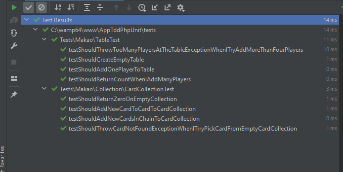

## Instralacj i konfiguracja 
1 --generate-configuration 


## Cykl red => green => refactor
* RED = testy nie przechodzą =>
* GREEN = Implementacja spełniająca warunki testowe =>
* REFACTOR = Sprzątanie i optymalizacja =>

## Metoda 0,1,n,exception
* 0 = Test dla pustego przypadki
* 1 = Pozytywny scenariusz dla jednego elementu
* N = Pozytywny scenariusz dla wielu elementów 
* Exception = testy dla wszystkich wyjątków jakie mogą pojawić się w trakcie.

## Setup klas testowych

* public function setUp() = Jest uruchamiana przed każdym testem.
* public function tearDown() = Jest uruchamiana po każdym teście.
* public function setUpBeforeClass() = Jest uruchamiana tylko raz, przed pierwszym testem, na początku.
* public function tearDownAfterClass() = Jest uruchamiana tylko raz, po ostatnim testem, na końcu.

## Schemat nazewnictwa metod testów

``` 
public function testShould()
{
    // Expect
    
    // Given

    // When

    // Then
}
```
### Poprzez odpowiednie nazewnictwo metod testów możemy zebrać zbiór wymagań projektu.




